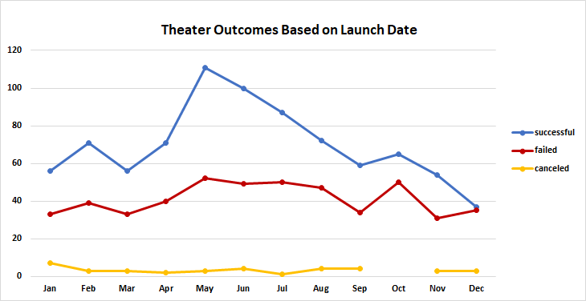
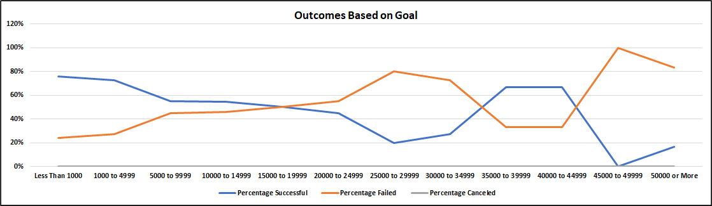

# Kickstarting with Excel

## Overview of Project
Analysis of Kickstarter data that includes campaign goals, performance, inception date as well as the type of event being funded as it relates to theater and plays.
### Purpose
To determine how different campaigns performed with respect to their launch dates and their funding goals.
## Analysis and Challenges
Data analysis for the two scenarios in question was straight forward as the data was clean and consistant. Had the data compiled contained inconsistenciea such as spell, abbreviations, or even text and numeric data in the same set, cleaning the data would have been neccesary adding to the effort of analysis.

The first scenario analyzed, outcomes vs launch dates, was performed by creating a pivot table to parse the data into instances based on the campaigns outcome (succsessful, failed, or canceled) by month of the year. A graph of the results is shown below.

The second scenario analyzed, outcomes based on goal, was performed by creating a table that subdivided the goal into groupings conting the instances of successful, failed, and canceled plays in each group. Using that information a percentage for each was calculated to more easily visually represent the results. This graph is shown below.

### Analysis of Outcomes Based on Launch Date

The analysis of the outcomes based on launch date revealed that the month that saw the most successful campaigns were launched in May. Also, there was little differentiation by month respect to failed campaigns.

### Analysis of Outcomes Based on Goals

The analysis of outcomes based on goals indicates that the highest percentage od successful campaigns were in the less than 1000 pounds range.

### Challenges and Difficulties Encountered

The only significant challange posed by the data set was the format the date fields were in requiring a conversion from a Unix format to a date value the analysis software (in thi scase Excel) could readily accept.

## Results

- Based on the analysis of outcomes vs launch date, it can be seen that there is little differentiation of instances or failure based on month. However, the analysis also revealed that May would be the optimal month to launch a campaign as it saw the highest instnaces of success.

- Based on the analysis of outcomes based on goals, it can be seen that keeping the goal less than 1000 pounds carries the greatest chance of success.

- It should be noted that theater comprised 1369 insatnces and plays only made up 1043 insatnces within the data set. A greater data population may reveal different results.

- To further refine the results above, analysis further refining the theater outcomes based on launch date by including goal ranges resulting in a seperate graph for each range could potentially reveal a better launch month for a specific goal range. Also, by performing a frequency distribution generating a histogram on the outcomes based on goals data could reveal that the range of less than 1000 pounds may not be required as the amount of successful instances is also relavant to decision.